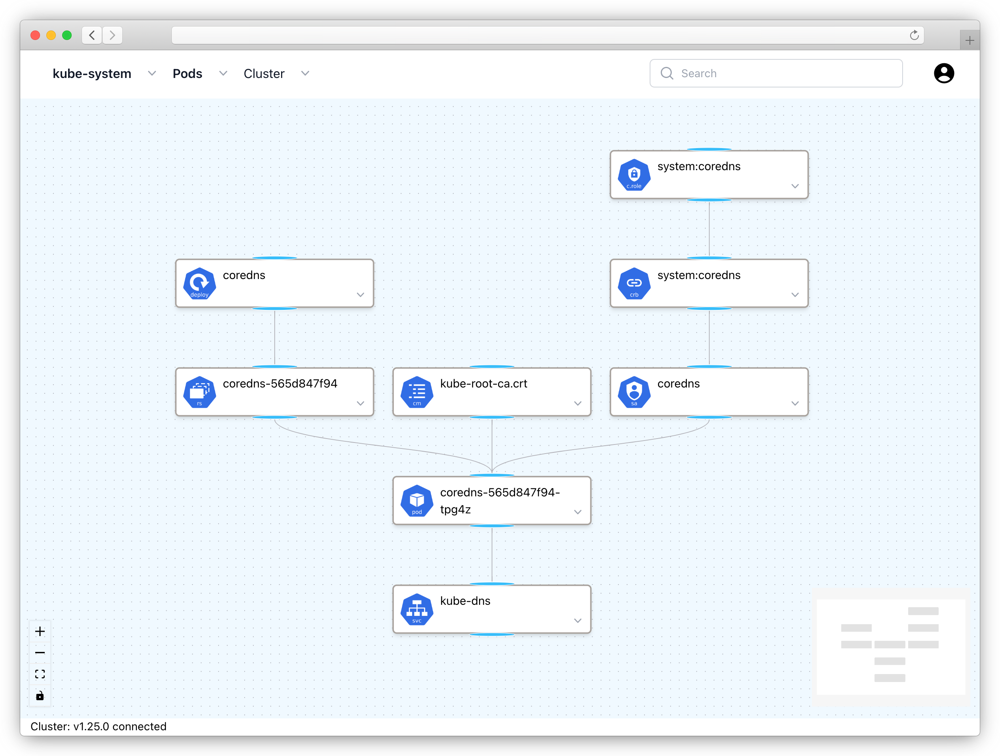

# Flightdeck

**IMPORTANT:** This is not production-ready software. This project is in active development.

## Introduction

Flightdeck is a web-based interactive diagram UI for Kubernetes clusters. It allows users to observe and troubleshoot applications running in the cluster.



### Features

* Search cluster resources
* Resource dependencies graph
* Pod logs, description, yaml
* Container file browser
* Login with service account token
* Uses K8s RBAC

## Getting Started

**IMPORTANT:** The default flightdeck deployment contains a minimal set of RBAC privileges needed to run. flightdeck acts as a proxy and only users with a valid bearer token can access the UI and see the Kubernetes resoures.

### Install

The basic installation creates the `flightdeck` namespace with all resources needed to run the application. 

```shell
kubectl apply -f https://raw.githubusercontent.com/autovia/flightdeck/main/deploy/flightdeck.latest.yaml
```

### Access

To access the flightdeck UI from your local workstation you must create a bearer token and a port-forward. Run the following commands:

```shell
kubectl -n flightdeck create token admin-user
kubectl -n flightdeck port-forward pod/<flightdeck-podname> 3000:3000
```

Note: The token expires after one hour. Use e.g. `--duration=12h` to change the expiration time to 12 hours.

Now open your browser `localhost:3000` and copy the bearer token and paste it into the `Bearer token` field on the login screen.

Click the `Sign in` button and that's it. You are now logged in as an admin.

### Clean up

Remove the admin-user `ServiceAccount` and `ClusterRoleBinding`.

```shell
kubectl -n flightdeck delete serviceaccount admin-user
kubectl -n flightdeck delete clusterrolebinding admin-user
```

Delete the `flightdeck` namespace.

```shell
kubectl delete namespace flightdeck
```

## License

[Apache License 2.0](https://github.com/autovia/flightdeck/blob/master/LICENSE)

----
_Copyright [Autovia GmbH](https://autovia.de)_
